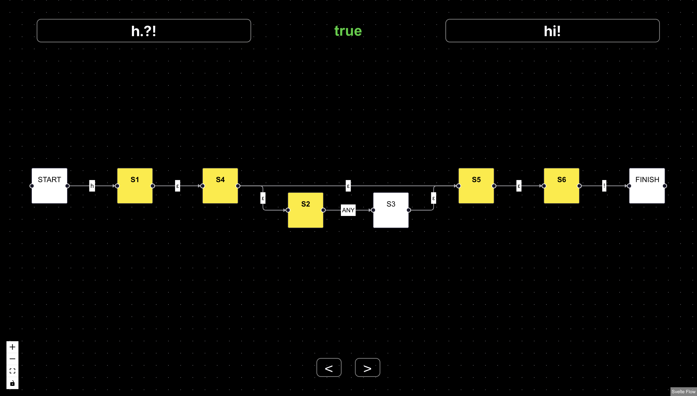

# RegEx Engine Visualiser

This project contains;

- A library containing a TypeScript implementation of a RegEx engine consisting of a recursive descent parser and an evaluator based on [Thompson's Construction](https://en.wikipedia.org/wiki/Thompson%27s_construction)
- An application designed to visualise the output of the above library, which plots an interactive network diagram of the non-deterministic finite state machine representation of the given RegEx

## Table of Contents

- [Features](#features)
  - [Library](#library)
  - [Application](#application)
- [Running the application locally](#running-the-application-locally)
- [Tests](#tests)
- [Acknowledgements](#acknowledgements)

## Features

### Library

This table outlines the currently supported special RegEx characters;

| Symbol | Meaning                                          |
| ------ | ------------------------------------------------ |
| \*     | Match the previous expression zero or more times |
| +      | Match the previous expression one or more times  |
| ?      | Match the previous expression zero or one times  |
| .      | Match any character                              |
| \|     | Match the expression to the left or to the right |
| (      | Start of a group expression                      |
| )      | End of a group expression                        |

> NOTE: Backreferences are not supported by design, as they require an evaluator which supports exponential backtracking. See the [re2 Wiki](https://github.com/google/re2/wiki/syntax) for more info.

### Application



- Editing the RegEx will automatically update the graph
- Change the test string to evaluate if it matches
- Step through the string evaluation states with the arrow buttons
- [dagre.js](https://github.com/dagrejs/dagre) is used to calculate the graph layout
- [SvelteFlow](https://svelteflow.dev/) is used to render the graph

## Running the application locally

> NOTE: Requires a modern version of Node (>20)

```bash
git clone git@github.com:jasonleelunn/regex-visualiser.git

cd regex-visualiser

corepack enable

pnpm install

pnpm run dev
```

## Tests

Run the library unit and integration tests with the following command;

```bash
pnpm run test
```

## Acknowledgements

- Inspired by the [0DE5 Chapter 2](https://www.0de5.net/explore) series of lectures and notes
